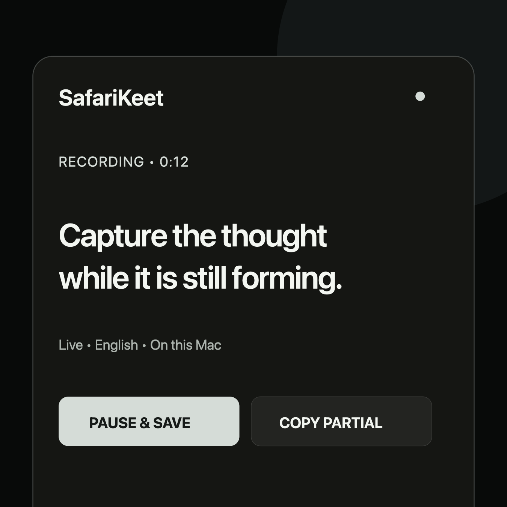

# SafaraKeet

Private, local-first dictation from your phone or tablet to your Mac.



[Watch the short product video](docs/media/safarakeet-promo.mp4)

Speak in a browser, get a live English transcript from a local speech engine,
then copy, edit, archive, or keep the block in local history. SafaraKeet does
not send audio to a cloud transcription service.

## The one requirement: private HTTPS

Modern browsers allow microphone capture only in a secure context. A LAN or
tailnet IP using plain HTTP can show the app, but it cannot record. Use
Tailscale Serve to publish the local app as a private HTTPS site inside your
tailnet.

```sh
./scripts/service.sh install
./scripts/share.sh start
./scripts/share.sh open
```

Open the private HTTPS address opened by `share.sh open` on each device. It is the
canonical SafaraKeet address: use that same hostname and port every time.

On iPhone or iPad, allow the microphone for that website when prompted. In
Safari, use Website Settings to keep Microphone set to **Allow**, then use
Share → Add to Home Screen and enable “Open as Web App.” Permission belongs to
the browser and that exact HTTPS origin; SafaraKeet cannot grant or retain it
on the browser's behalf.

Keep the web app foregrounded while recording. If you switch apps, SafaraKeet
stops the microphone and asks the server to save the current block; returning
does not silently restart recording. iOS can still freeze a web app before that
final save completes, so background recording is not guaranteed.

## Everyday use

```sh
./scripts/service.sh start
./scripts/share.sh status
./scripts/share.sh open
```

To stop the local app, run `./scripts/service.sh stop`. The background service
starts automatically after it has been installed. Use `/api/health` to inspect
the selected local engine and `./scripts/share.sh status` to check private HTTPS.

## What it does

- Selects an available local Parakeet or Whisper transcription engine.
- Shows live transcription while recording when the selected engine supports it.
- Saves completed dictation blocks in local history.
- Lets you copy a finished block into a new one, edit and save it, or archive it.
- Keeps archived blocks recoverable until you delete them.
- Selects many history blocks at once for archive, restore, or deletion.

## Troubleshooting

| Problem | Check |
| --- | --- |
| Record button cannot access the mic | Open the canonical private HTTPS address, then check the browser's website microphone permission. |
| The secure link is unavailable | Run `./scripts/share.sh status`, then `./scripts/share.sh start`. |
| SafaraKeet is unavailable | Run `./scripts/service.sh status`, then `./scripts/service.sh start`. |
| No transcription engine is ready | Run `./scripts/check.sh` and follow its local setup guidance. |

## Privacy

- Audio is streamed only to the Mac running SafaraKeet, transcribed locally,
  and discarded after processing.
- Saved transcript text remains in local SQLite history until you delete it.
- Tailscale Serve limits the HTTPS site to devices authorized by your tailnet.
- SafaraKeet does not add its own login. Anyone allowed to reach the service by
  your tailnet access rules can use its transcript-history API.
- Application logs contain request and error metadata, not audio or transcript
  bodies. The Mac operator can still read the saved local history database.
- FluidVoice is neither controlled nor exposed by SafaraKeet.

## License

SafaraKeet is MIT licensed. Speech models are downloaded separately and remain
subject to their upstream licenses. See [LICENSE](LICENSE).
